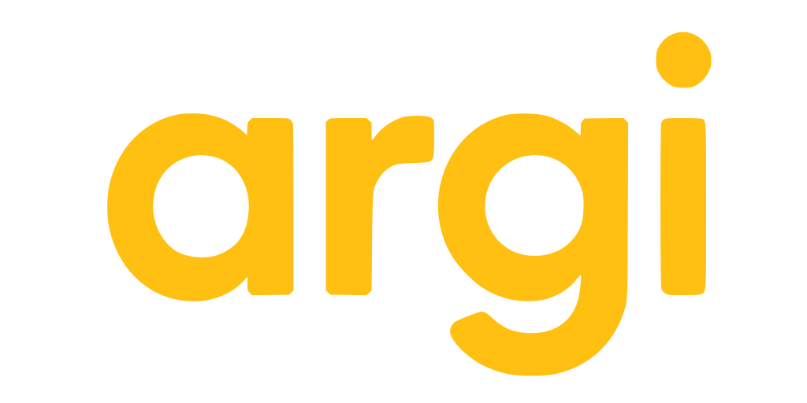

  

Argi is a general purpose programming language that aims to bridge the gap
between the convenience of high-level languages (Python, Julia...) and the
performance and control of low-level languages (C, Zig...).

It’s an early work-in-progress.

- 💭 Language design notes are in [`description/`](description/).
- ⚙️ The compiler is in [`compiler/`](compiler/) and is written in **Zig**,
targeting **LLVM**.

Highlights:

- Manual but very ergonomic memory management.
- Side-effects are always explicit.
- No objects or inheritance.
- Polymorphism through:
    - Multiple dispatch
    - Generics
    - Abstract types (rust's traits style)
    - Virtual types (dynamic dispatch)
- Errable and Nullable types.
- Big core library.

